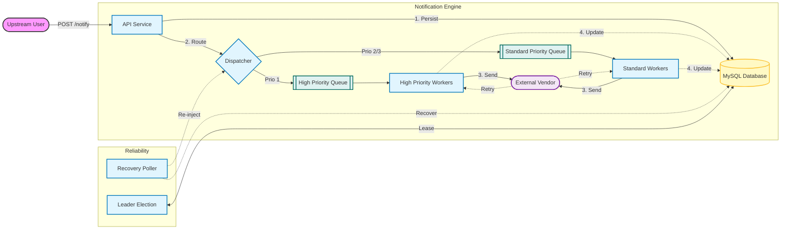

# API Notification System

A robust, high-availability, priority-aware notification delivery middleware built with Java 21 and Spring Boot. This system acts as a reliable bridge between internal services and external third-party vendor APIs, ensuring at-least-once delivery, handling failures, and providing template processing.

## 1. Overall Architecture and Core Design

The system is designed as a **Hybrid Dispatch** engine that combines the reliability of persistent storage with the low-latency performance of in-memory queues.

### Core Components


*   **Unified Ingress API (`NotificationController`)**: Accepts notification requests, validates them, and persists them to MySQL (`notification_job` table).
*   **Hybrid Dispatch Strategy**:
    *   **Hot Path**: Upon persistence, jobs are immediately pushed to in-memory queues (`QueueManager`), allowing consumers to pick them up instantly without polling the DB.
    *   **Cold Path (Reliability)**: A background `RecoveryPoller` scans the DB for "stuck" jobs (e.g., due to an application crash before memory processing) or failed jobs ready for retry, and re-injects them into the processing stream.
*   **Virtual Threads**: Utilizes Java 21's virtual threads for high-throughput, blocking-IO friendly concurrency.
*   **Priority Management**:
    *   **High Priority (Level 1)**: Dedicated thread pool and queue to ensure critical alerts are never blocked by bulk traffic.
    *   **Standard Priority (Level 2/3)**: Shared priority queue ordered by priority and creation time.
*   **Template Engine**: Uses **FreeMarker** to transform internal JSON events into vendor-specific API formats.

### Technology Stack
*   **Language**: Java 21
*   **Framework**: Spring Boot 3.2.x
*   **Database**: MySQL 8.0+
*   **Communication**: `RestClient` (HTTP)

---

## 2. How to Build and Run

### Prerequisites
*   Java 21 JDK installed (`JAVA_HOME` configured).
*   MySQL 8.0+ running on port `3306`.
*   Maven installed.

### Configuration
Update `src/main/resources/application.yml` with your database credentials:
```yaml
spring:
  datasource:
    url: jdbc:mysql://localhost:3306/notification_db
    username: YOUR_USERNAME
    password: YOUR_PASSWORD
```

### Build
Package the application into an executable JAR:
```bash
mvn clean package
```

### Run
Run the application:
```bash
java -jar target/notification-system-0.0.1-SNAPSHOT.jar
```

### Verification
You can send a test notification:
```bash
curl -X POST http://localhost:8080/api/v1/notifications \
  -H "Content-Type: application/json" \
  -d '{
    "targetUrl": "https://httpbin.org/post",
    "priority": 1,
    "payload": {"message": "Hello World"}
  }'
```

---

## 3. Key Engineering Decisions and Trade-offs

### System Boundaries
**What we solved:**
*   **Reliable Delivery**: Shielding internal systems from external vendor downtimes and network flakes.
*   **Format Abstraction**: Internal systems emit generic events; this broker transforms them into specific vendor payloads (JSON/XML/Form) via templates.
*   **Throttling & Isolation**: Preventing low-priority marketing blasts from delaying high-priority security alerts.
*   **High Availability**: Ensuring the system can handle failures and continue processing notifications by master-slave architecture.

**What we explicitly chose NOT to solve:**

*   **Receiver Idempotency**: We do not strictly guarantee "Exactly-Once" because it requires receiver cooperation. We guarantee "At-Least-Once".
*   **Rate Limit**: We do not implement rate limiting at the broker level for current MVP version, but eventually its required.
*   **Message Queue**: We assume current in-memory system is enough for most startup companies, introduce external meesage queue too early is kind of over-optimization.

### Reliability and Failure Handling

**Delivery Semantics: At-Least-Once**
*   We prioritize **eventual delivery** over strictly avoiding duplicates.
*   In case of acknowledgement failures (e.g., vendor receives data but connection cuts before 200 OK), we *will* retry, potentially sending a duplicate. The receiving vendor is expected to handle idempotency (e.g., via request IDs).

**Handling Unavailable External Systems**
*   **Transient Failures (Timeouts, 5xx)**: 
    1. A `SystemMonitorService` runs on the leader node every 1 minute. It calculates the failure rate of external services over the last 5 minutes. If the failure rate exceeds **50%**, an alarm is triggered (via `AlarmService`) to notify engineers of a potential vendor outage.
    2. Handled via **Exponential Backoff**. The `next_retry_at` is calculated with an increasing multiplier to prevent thundering herd effects on the struggling vendor.
*   **Prolonged Outages**: Jobs will retry until a `MAX_RETRIES` threshold (default 5). After this, they are marked as `MAX_RETRIES` (Dead Letter).
*   **Crash Recovery**: If the application node crashes while processing a job (or before pushing to memory). The `RecoveryPoller` detects jobs that have been `PENDING`  and automatically recovers them.
*   **Task Timeouts**: Every execution is wrapped in a 30s timeout. If a vendor API hangs indefinitely, the virtual thread is freed, and the job is marked for retry, ensuring the system never deadlocks.

### Trade-offs and the Future

#### Denied AI advises

* PostgreSQL: It's well designed DBMS and has strict sematics with high performance, but we should consider the fact that most developers in this country are not familiar with it.
* Interaction between Controller and Dispatcher: The gemini's implementation, API controller saves job to DB and dispatcher picks it up from DB. It introduce unnecessary complexity and potential performance issue. We finally choose to push job to in-memory queue after persisting and introduce a priority management mechanism to ensure high-priority jobs are processed as soon as possible and not blocked by low-priority jobs.

#### The Future

As business grows, we should consider the evolution of this system in following dimensions:

* Stateless Service to make us able to scale horizontally.
* Introduce external message queue service so we can decouple the API and dispatchers to make our architecture much more extensive and flexible and we can reuse the durability of it rather than saving it in DB by ourselves.
* Rate limiting to prevent our system and exteranl vendors being overwhelmed.
* Observability and metrics to let us could monitor the system and find out the potential issues.
* Better error awareness and propagation. Specifically, we must communicate long-term external service failures to internal callers and trigger a circuit-breaking mechanism to stop further calls.